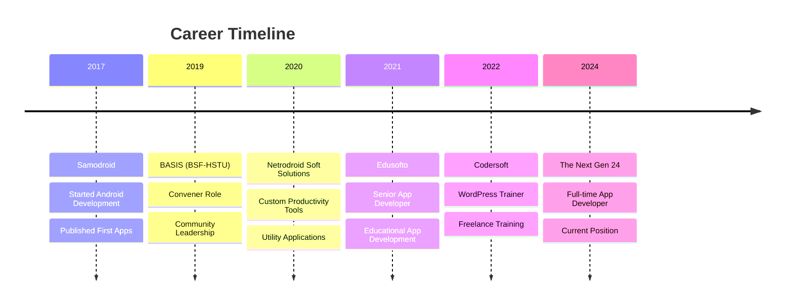

<!-- 
    ██████╗  █████╗ ███╗   ███╗ ██████╗ ██████╗  █████╗ 
    ██╔════╝██╔══██╗████╗ ████║██╔═══██╗██╔══██╗██╔══██╗
    ███████╗███████║██╔████╔██║██║   ██║██████╔╝███████║
    ╚════██║██╔══██║██║╚██╔╝██║██║   ██║██╔══██╗██╔══██║
    ███████║██║  ██║██║ ╚═╝ ██║╚██████╔╝██████╔╝██║  ██║
    ╚══════╝╚═╝  ╚═╝╚═╝     ╚═╝ ╚═════╝ ╚═════╝ ╚═╝  ╚═╝
-->

<div align="center">
  
  <!-- Animated Header -->
  

  <!-- Typing Animation -->
  <a href="https://git.io/typing-svg">
    
  </a>

  <!-- Profile Views & Social Badges -->
  <p>
    
    <a href="https://www.linkedin.com/in/shawon-hossain-samoba">
      
    </a>
    <a href="mailto:shawon.hossain.samoba.bd@gmail.com">
      
    </a>
    <a href="https://samoba.pages.dev">
      
    </a>
    <a href="https://fb.me/pop.shawon.3">
      
    </a>
  </p>
  
</div>

---

##  About Me

```typescript
const shawonHossain = {
    name: "Shawon Hossain Samoba",
    location: "Bangladesh 🇧🇩",
    roles: ["Android Developer", "Backend Developer", "IT Professional"],
    experience: "8+ years",
    education: {
        masters: "MSS in Economics - HSTU",
        bachelors: "BSS in Economics - HSTU (CGPA: 3.45/4.00)"
    },
    currentlyWorkingAt: "The Next Gen 24",
    passions: ["Mobile App Development", "Backend Architecture", "UI/UX Design"],
    funFact: "I blend economic insights with technical expertise! 📊💻"
};
```


### 🎯 Quick Highlights

- 🔭 Currently working as **App Developer** at **The Next Gen 24**
- 🌟 **Convener** at **BASIS (BSF-HSTU)** since 2019
- 💼 Previously worked at **Edusofto**, **Codersoft**, **Samodroid**
- 🎓 **Economics** background with **Master's Degree**
- 🎨 Experienced in **Graphic Design** & **Video Editing**
- ✍️ AI-powered **Script & Content Writer**
- 📱 Published multiple apps on **Google Play Store**

<br clear="right"/>

---

##  Tech Stack

<div align="center">

### 👨‍💻 Programming Languages
<p>
  
  
  
  
  
  
  
</p>

### 📱 Mobile Development
<p>
  
  
  
  
</p>

### 🌐 Backend & Frameworks
<p>
  
  
  
  
  
</p>

### 💾 Databases
<p>
  
  
  
</p>

### ☁️ Cloud & DevOps
<p>
  
  
  
  
  
</p>

### 🛠️ Tools & Platforms
<p>
  
  
  
  
</p>

</div>

---

##  Featured Projects

<div align="center">

<table>
  <tr>
    <td width="50%">
      <h3 align="center">📚 Edufee</h3>
      <p align="center">
        <a href="#" target="_blank">
          
        </a>
      </p>
      <p align="center">
        Education fee management app for Edufee.com.bd with RESTful APIs integration, invoice management, and seamless payment tracking.
      </p>
      <p align="center">
        
        
        
      </p>
    </td>
    <td width="50%">
      <h3 align="center">🛒 Enamimart</h3>
      <p align="center">
        <a href="#" target="_blank">
          
        </a>
      </p>
      <p align="center">
        Full-featured eCommerce Android application with secure online shopping, cart management, and payment integration.
      </p>
      <p align="center">
        
        
        
      </p>
    </td>
  </tr>
  <tr>
    <td width="50%">
      <h3 align="center">🤖 AutoClicker Bot</h3>
      <p align="center">
        <a href="#" target="_blank">
          
        </a>
      </p>
      <p align="center">
        Automation tool for repetitive screen taps on Android, featuring customizable intervals, multi-touch support, and accessibility integration.
      </p>
      <p align="center">
        
        
        
      </p>
    </td>
    <td width="50%">
      <h3 align="center">📧 Mailfo</h3>
      <p align="center">
        <a href="#" target="_blank">
          
        </a>
      </p>
      <p align="center">
        Temporary email management app with real-time inbox updates, email history tracking, and privacy-focused design.
      </p>
      <p align="center">
        
        
        
      </p>
    </td>
  </tr>
</table>

</div>

---

##  GitHub Analytics

<div align="center">
  
   
  

</div>

<div align="center">
  
</div>

<br/>

<div align="center">
  
</div>

---

##  Professional Journey



---

##  Achievements & Contributions

<div align="center">

| 🏆 Achievement | 📝 Description |
|:---:|:---|
| **8+ Years Experience** | Extensive expertise in Android & Web Development |
| **Multiple Published Apps** | Successfully launched apps on Google Play Store |
| **Community Leader** | Convener at BASIS (BSF-HSTU) since 2019 |
| **Educator & Trainer** | WordPress development training at Codersoft |
| **Multi-disciplinary Skills** | Economics + Tech + Design + Content Creation |

</div>

---

##  Let's Connect!

<div align="center">
  
  <a href="mailto:shawon.hossain.samoba.bd@gmail.com">
    
  </a>
  
  <br/><br/>
  
  <a href="https://samoba.pages.dev">
    
  </a>
  
  <br/><br/>
  
  <a href="https://www.linkedin.com/in/shawon-hossain-samoba">
    
  </a>
  <a href="https://fb.me/pop.shawon.3">
    
  </a>
  
</div>

---

<div align="center">
  
  ### 💭 Random Dev Quote
  
  
  
</div>

---

<div align="center">
  
  <!-- Snake Animation -->
  <picture>
    <source media="(prefers-color-scheme: dark)" srcset="https://raw.githubusercontent.com/platane/snk/output/github-contribution-grid-snake-dark.svg"/>
    <source media="(prefers-color-scheme: light)" srcset="https://raw.githubusercontent.com/platane/snk/output/github-contribution-grid-snake.svg"/>
    
  </picture>
  
</div>

---

<div align="center">
  
  
  
  <p>
    <i>⭐ From <a href="https://github.com/samoba-islam">Shawon Hossain Samoba</a> with ❤️</i>
  </p>
  
  
  
  
</div>

<!-- 
    Thank you for visiting my profile! 
    Feel free to reach out for collaboration opportunities.
    Let's build something amazing together! 🚀
-->
