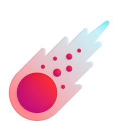
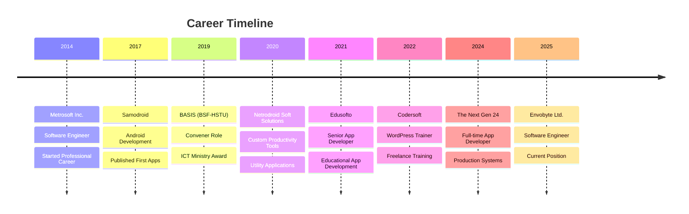

<!-- 
    ██████╗  █████╗ ███╗   ███╗ ██████╗ ██████╗  █████╗ 
    ██╔════╝██╔══██╗████╗ ████║██╔═══██╗██╔══██╗██╔══██╗
    ███████╗███████║██╔████╔██║██║   ██║██████╔╝███████║
    ╚════██║██╔══██║██║╚██╔╝██║██║   ██║██╔══██╗██╔══██║
    ███████║██║  ██║██║ ╚═╝ ██║╚██████╔╝██████╔╝██║  ██║
    ╚══════╝╚═╝  ╚═╝╚═╝     ╚═╝ ╚═════╝ ╚═════╝ ╚═╝  ╚═╝
-->

<div align="center">
  
  <!-- Animated Header -->
  

  <!-- Typing Animation -->
  <a href="https://git.io/typing-svg">
    
  </a>

  <!-- Profile Views & Social Badges -->
  <p>
    
    <a href="https://www.linkedin.com/in/shawon-hossain-samoba">
      
    </a>
    <a href="mailto:shawon.hossain.samoba.bd@gmail.com">
      
    </a>
    <a href="https://samoba.pages.dev">
      
    </a>
    <a href="https://fb.me/pop.shawon.3">
      
    </a>
  </p>
  
</div>

---

##  About Me

```typescript
const shawonHossain = {
    name: "Shawon Hossain Samoba",
    location: "Faridpur, Bangladesh 🇧🇩",
    roles: ["Android Developer", "Backend Developer", "Open Source Contributor"],
    experience: "10+ years (since 2014)",
    education: {
        masters: "MSS in Economics — HSTU (CGPA: 3.53/4.00)",
        bachelors: "BSS in Economics — HSTU (CGPA: 3.45/4.00)",
        hsc: "Humanities — Govt. Rajendro College, Faridpur (CGPA: 4.17/5.00)",
        ssc: "Humanities — Noyadangi High School (CGPA: 4.63/5.00)"
    },
    currentFocus: ["Android Libraries", "Backend Systems", "AI-Powered Apps"],
    funFact: "I blend economic insights with technical expertise! 📊💻"
};
```


### 🎯 Quick Highlights

- 🏢 Previously worked at **Envobyte Ltd.**, **The Next Gen 24**, **Edusofto**, **Codersoft**, **Metrosoft Inc.**
- 🏆 **ICT Ministry "Student to Startup Chapter 2"** Award Recipient
- 🌟 **Convener** at **BASIS (BSF-HSTU)** since 2019
- 📱 **100+ Published Apps** on **Google Play Store**
- 📦 **3 Open Source Android Libraries** on GitHub
- 🎓 **Economics** background with **Master's Degree (CGPA: 3.53)**
- 🎨 Experienced in **Graphic Design** & **Video Editing**
- ✍️ AI-powered **Script & Content Writer**

<br clear="right"/>

---

##  Tech Stack

<div align="center">

### 👨‍💻 Programming Languages
<p>
  
  
  
  
  
  
  
</p>

### 📱 Mobile Development
<p>
  
  
  
  
</p>

### 🌐 Backend & Frameworks
<p>
  
  
  
  
  
  
  
  
</p>

### 💾 Databases
<p>
  
  
  
</p>

### ☁️ Cloud & DevOps
<p>
  
  
  
  
  
  
</p>

### 🛠️ Tools & Platforms
<p>
  
  
  
  
</p>

</div>

---

##  Featured Projects

<div align="center">

<table>
  <tr>
    <td width="50%">
      <h3 align="center">📝 DocxKitWriter</h3>
      <p align="center">
        <a href="https://github.com/samoba-islam/DocxKitWriter" target="_blank">
          
        </a>
      </p>
      <p align="center">
        World's first offline Android library for coordinate-based exact-point data writing inside <code>.docx</code> files. Ideal for automated reports, invoices, certificates, and form-based document systems.
      </p>
      <p align="center">
        
        
        
      </p>
    </td>
    <td width="50%">
      <h3 align="center">🖼️ PhotoCollegeKit</h3>
      <p align="center">
        <a href="https://github.com/samoba-islam/PhotoCollegeKit" target="_blank">
          
        </a>
      </p>
      <p align="center">
        Reusable Android photo collage editor library built with Jetpack Compose. Features customizable templates, gesture-based image manipulation (drag, swap, replace), and built-in image selection.
      </p>
      <p align="center">
        
        
        
      </p>
    </td>
  </tr>
  <tr>
    <td width="50%">
      <h3 align="center">📷 ImagePickKit</h3>
      <p align="center">
        <a href="https://github.com/samoba-islam/ImagePickKit" target="_blank">
          
        </a>
      </p>
      <p align="center">
        Custom Android image picker library with intuitive, customizable UI. Handles permission flows, gallery access, and multi-image selection without external dependencies.
      </p>
      <p align="center">
        
        
        
      </p>
    </td>
    <td width="50%">
      <h3 align="center">🔐 Stag VPN</h3>
      <p align="center">
        <a href="#" target="_blank">
          
        </a>
      </p>
      <p align="center">
        Secure & Fast Proxy VPN app supporting IKEv2 and OpenVPN protocols with backend server and admin panel for managing user access and server configurations.
      </p>
      <p align="center">
        
        
        
      </p>
    </td>
  </tr>
  <tr>
    <td width="50%">
      <h3 align="center">🤖 AutoClicker Bot</h3>
      <p align="center">
        <a href="#" target="_blank">
          
        </a>
      </p>
      <p align="center">
        Automation tool for repetitive screen taps on Android, featuring customizable intervals, multi-touch support, and accessibility integration.
      </p>
      <p align="center">
        
        
        
      </p>
    </td>
    <td width="50%">
      <h3 align="center">⌨️ ImproveType AI Keyboard</h3>
      <p align="center">
        <a href="#" target="_blank">
          
        </a>
      </p>
      <p align="center">
        AI-powered typing keyboard for Android with intelligent text prediction, autocorrection, and enhanced typing experience.
      </p>
      <p align="center">
        
        
        
      </p>
    </td>
  </tr>
  <tr>
    <td width="50%">
      <h3 align="center">💰 USSD Payment Automation</h3>
      <p align="center">
        <a href="#" target="_blank">
          
        </a>
      </p>
      <p align="center">
        Android app using Accessibility Services for USSD automation, enabling seamless interactions with bKash, Nagad, and other mobile payment gateways.
      </p>
      <p align="center">
        
        
        
      </p>
    </td>
    <td width="50%">
      <h3 align="center">🏫 Edubdn School Management</h3>
      <p align="center">
        <a href="#" target="_blank">
          
        </a>
      </p>
      <p align="center">
        Comprehensive school management system deployed across multiple production schools (NKBHS, VNHS, FKHS, KKDGHS) with student, fee, and academic management.
      </p>
      <p align="center">
        
        
        
      </p>
    </td>
  </tr>
</table>

</div>

---

## 📲 Published on Google Play Store

<div align="center">
<p>
  
  
</p>
<p>
  
  
</p>
<p>
  
  
</p>

> 📊 **100+ apps published** across **4 Play Console accounts** managed from 2017–2025, including currently live and retired applications.

</div>

---

##  GitHub Analytics

<div align="center">
  
   
  

</div>

<div align="center">
  
</div>

<br/>

<div align="center">
  
</div>

---

##  Professional Journey



---

## 🎓 Academic Qualifications

<div align="center">

| 📜 Degree | 📚 Concentration | 🏛️ Institute | 📊 Result | 📅 Year |
|:---:|:---:|:---:|:---:|:---:|
| **MSS** (Master of Social Science) | Economics | Hajee Mohammad Danesh Science & Technology University | **CGPA: 3.53/4.00** | 2022 |
| **BSS** (Bachelor of Social Science) | Economics | Hajee Mohammad Danesh Science & Technology University | **CGPA: 3.45/4.00** | 2021 |
| **HSC** | Humanities | Govt. Rajendro College, Faridpur | **CGPA: 4.17/5.00** | 2016 |
| **SSC** | Humanities | Noyadangi High School | **CGPA: 4.63/5.00** | 2014 |

</div>

---

##  Achievements & Contributions

<div align="center">

| 🏆 Achievement | 📝 Description |
|:---:|:---|
| **🏅 ICT Ministry Award** | Honored with **"Student to Startup Chapter 2"** award from the ICT Ministry for innovation in startup development |
| **10+ Years Experience** | Professional software engineering career since 2014 (Metrosoft Inc.) |
| **100+ Published Play Store Apps** | Successfully launched and maintained apps on Google Play Store |
| **3 Open Source Libraries** | DocxKitWriter, PhotoCollegeKit, and ImagePickKit on GitHub |
| **Community Leader** | Convener at BASIS (BSF-HSTU) since 2019 |
| **Production Web Systems** | School Management System deployed at 4+ schools across Bangladesh |
| **Educator & Trainer** | WordPress development training at Codersoft |
| **Multi-disciplinary Skills** | Economics + Tech + Design + AI + Content Creation |

</div>

---

## 🏋️ Training & Certifications

<div align="center">

| 📜 Training | 🏛️ Institute | 📍 Location | 📅 Year | ⏱️ Duration |
|:---:|:---:|:---:|:---:|:---:|
| **Office Applications** (MS Word, Excel, PowerPoint) | Bangladesh Technical Education Board | Thakurgaon | 2023 | 6 Months |
| **Startup Workshop** (Business Analysis, Product Development) | Student to Startup Bangladesh | Dhaka | 2019 | 3 Days |

</div>

---

##  Let's Connect!

<div align="center">
  
  <a href="mailto:shawon.hossain.samoba.bd@gmail.com">
    
  </a>
  
  <br/><br/>
  
  <a href="https://samoba.pages.dev">
    
  </a>
  
  <br/><br/>
  
  <a href="https://www.linkedin.com/in/shawon-hossain-samoba">
    
  </a>
  <a href="https://fb.me/pop.shawon.3">
    
  </a>
  
</div>

---

<div align="center">
  
  ### 💭 Random Dev Quote
  
  
  
</div>

---

<div align="center">
  
  <!-- Snake Animation -->
  <picture>
    <source media="(prefers-color-scheme: dark)" srcset="https://raw.githubusercontent.com/platane/snk/output/github-contribution-grid-snake-dark.svg"/>
    <source media="(prefers-color-scheme: light)" srcset="https://raw.githubusercontent.com/platane/snk/output/github-contribution-grid-snake.svg"/>
    
  </picture>
  
</div>

---

<div align="center">
  
  
  
  <p>
    <i>⭐ From <a href="https://github.com/samoba-islam">Shawon Hossain Samoba</a> with ❤️</i>
  </p>
  
  
  
  
</div>

<!-- 
    Thank you for visiting my profile! 
    Feel free to reach out for collaboration opportunities.
    Let's build something amazing together! 🚀
-->
